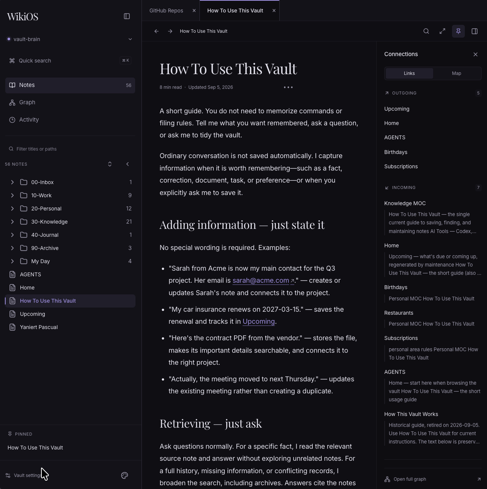
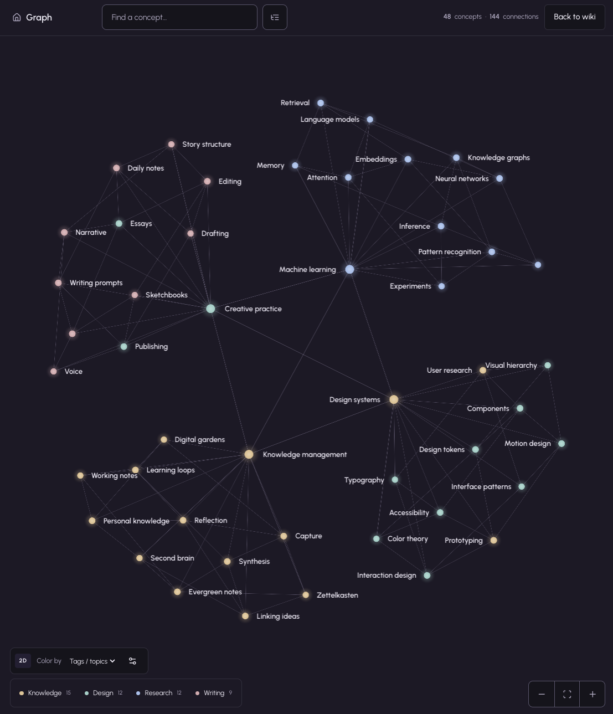

# WikiOS

WikiOS turns an Obsidian vault into a local web app with a tabbed reading workspace, fast search, and an interactive 2D knowledge graph.

Originally released as WikiOS under the MIT License. [Ansub/wiki-os.git](https://github.com/Ansub/wiki-os.git); this fork is maintained at [Yani3rt/WiKiOS](https://github.com/Yani3rt/WiKiOS).

## App previews

### Notes workspace



### Knowledge graph



The graph screenshot shows a demonstration vault.

## What it does

- Connects to an Obsidian-compatible markdown folder
- Builds a local searchable index
- Gives you a clean web interface for exploring your notes
- Watches the vault for changes and updates the index automatically
- Lets you switch vaults later from the in-app setup flow

## How to get started

Clone and launch:

Requires Node.js 20.19+ and pnpm 10.30.3 (`npm install --global pnpm@10.30.3`).

```bash
git clone https://github.com/Yani3rt/WiKiOS.git wiki-os && cd wiki-os && pnpm run first-run
```

WikiOS will open in your browser and guide you through choosing a vault. You can also use the bundled demo vault on first run.

## Features

- Continuous notes workspace with:
  - persistent reading tabs and searchable note tree
  - pinned notes and per-note scroll restoration
  - activity views for newly added, last updated, and recently opened notes
  - focus mode and desktop find-in-note
  - linked-note previews and incoming/outgoing connections
- Global command palette (`⌘K` / `Ctrl+K`) with recent notes and instant note search
- Wikilinks with vault-wide basename resolution and duplicate-note selection
- Full note viewer with table of contents, reading metadata, person controls, Mermaid diagrams, Markdown tables, and code-block copy buttons
- WebGL-powered 2D graph with:
  - luminous nodes, link-driven layout, and neural connection signals
  - a two-second entrance: nodes emerge, links trace, then labels fade in
  - tags/topics, folder, or neutral coloring
  - ordered topic priority, a counted clickable legend, and explicit color ownership
  - search, keyboard-accessible node browsing, zoom, and note inspection
  - reduced-motion support; interaction immediately finishes the entrance
- Teal, Blue, and Violet themes with Light, Dark, and System modes
- Vault switching, stats, manual reindexing, and automatic file watching
- Local-first operation with no cloud requirement

## Note categories and topics

WikiOS derives note categories from three sources, in this order:

1. frontmatter
2. folder path
3. content heuristics (only when the first two do not provide topics)

By default, these frontmatter keys are treated as note categories:

- `tags`
- `topics`
- `topic`
- `category`
- `categories`

Example:

```md
---
tags:
  - philosophy
  - writing
---
```

Folder names can also become note topics. By default, WikiOS uses up to two folder levels and ignores structural folders such as `notes/`, `topics/`, `docs/`, and `sources/`.

### Graph color rules

Graph coloring is separate from derived note categories. In **Tags / topics** mode, only explicit frontmatter values from the configured keys above are used—not inferred keywords or inline body hashtags.

Use the settings button beside **Color by** to order topics. The first matching topic determines a note's color; notes without a matching configured topic stay neutral. The initial priority is alphabetical. In **Folders** mode, the actual top-level folder determines the color. **None** gives every note a neutral color.

Colors describe groups, while positions follow actual links. Matching colors do not imply a detected community or a forced spatial cluster. The inspector lists all explicit topics and identifies the color owner.

Color mode and topic priority are saved per vault in the current browser, not synced into vault files. Existing index caches rebuild automatically when their schema changes; source Markdown is not rewritten. The graph is currently 2D; 3D is not included yet.

## Docker

You can run WikiOS with Docker if you want a simple container setup.

This starts WikiOS with the bundled demo vault:

```bash
docker compose up --build
```

The `docker-compose.yml` file is in the main project folder.

By default, Docker uses the demo notes in `sample-vault/`.

If you want to use your own Obsidian vault instead:

1. Open `docker-compose.yml`
2. Find this line:

```yml
- ./sample-vault:/vault:ro
```

3. Replace `./sample-vault` with the path to your own vault

Example:

```yml
- /Users/your-name/Documents/MyVault:/vault:ro
```

Leave `WIKI_ROOT: /vault` as it is.

For a direct build and run:

```bash
docker build -t wiki-os .
docker run --rm -p 5211:5211 -e WIKI_ROOT=/vault -v /path/to/your/vault:/vault:ro -v wiki-os-data:/data wiki-os
```

## Contributor mode

For normal users, use:

```bash
pnpm start
```

For contributors working on WikiOS itself, use:

```bash
pnpm run dev
```

`dev` runs a split frontend/backend setup for faster iteration.

During development, Setup can be used to switch to a different vault later at:

```bash
http://localhost:5211/setup?change=1
```

If you started the app with `WIKIOS_FORCE_WIKI_ROOT`, vault switching is intentionally locked for that process until you restart without it.

## Folder structure

- `src/client/` contains the React app, routes, and UI components
- `src/server/` contains the Fastify server, setup flow, runtime config, and platform helpers
- `src/lib/` contains the wiki core
- `sample-vault/` contains the bundled demo content
- `scripts/` contains launch, deploy, and smoke-test helpers

## Advanced

### Useful commands

- `pnpm run first-run` installs dependencies and starts the guided first-run flow
- `pnpm start` starts the app in user mode
- `pnpm run dev` starts the contributor split client/server setup
- `pnpm run build` builds the client and server
- `pnpm run serve` runs the already-built server
- `pnpm run deploy` runs the deployment helper
- `pnpm run smoke-test` runs the smoke test helper
- `docker compose up --build` runs the app in Docker with the bundled demo vault

### Environment variables

- `WIKI_ROOT` bootstraps the app with a vault path
- `WIKIOS_FORCE_WIKI_ROOT` forces a temporary per-process vault override
- `PORT` sets the server port
- `WIKIOS_INDEX_DB` overrides the SQLite index path
- `WIKIOS_ADMIN_TOKEN` protects the manual reindex endpoint
- `WIKIOS_DISABLE_WATCH=1` disables filesystem watching

By default, WikiOS saves the selected vault in `~/.wiki-os/config.json` and stores hashed SQLite indexes under `~/.wiki-os/indexes/`.

### People model

WikiOS treats `People` as an explicit, user-controlled concept first. By default it recognizes people from:

- frontmatter keys like `person`, `people`, `type`, `kind`, and `entity`
- tags like `person`, `people`, `biography`, and `biographies`
- folders like `people/`, `person/`, `biographies/`, and `biography/`

You can customize this in `wiki-os.config.ts` with `people.mode`:

- `explicit` is the safest default
- `hybrid` allows broader inference after explicit metadata
- `off` hides People entirely

Local person overrides are saved in `~/.wiki-os/config.json` and do not rewrite your notes.

### Workspace and note navigation

The root route (`/`) opens the notes workspace. `/explorer/:slug` opens a note in that workspace, while `/wiki/:slug` redirects there and preserves query strings and heading anchors. Graph selections open notes in the same reading experience.

Tabs, pinned/recent notes, and scroll preferences are stored locally in the browser. The vault remains the source of truth for note content.

### Wikilink resolution

WikiOS resolves `[[Note]]` across the complete vault when the filename is unique.
`[[Folder/Note]]` always resolves from the vault root. If duplicate filenames exist,
a note in the source note's folder is preferred; otherwise WikiOS asks which complete
path to open instead of guessing.

## License

MIT
