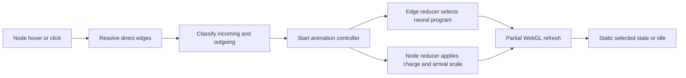

# Neural Graph WebGL Design

## Goal

Make the Knowledge Graph feel like a living neural network while keeping it quiet, readable, and inexpensive at rest. Interaction should reveal movement through only the active node's direct connections, and the rendering path must scale as the second-brain graph grows.

## Approved direction

- Use a custom Sigma WebGL edge program rather than a canvas overlay.
- Keep the graph completely still at rest.
- Animate only the hovered or selected node's direct connections.
- Use a smooth traveling light with a short fading tail rather than continuously flowing particles.
- Preserve the existing semantic direction colors: blue for outgoing links and amber for incoming links.
- Add no production dependency.
- Keep links straight in the initial implementation; curved animated geometry is outside this scope.

## Rendering architecture

The existing Sigma and Graphology stack remains responsible for graph layout, camera movement, labels, and interaction. The feature adds focused modules around that renderer:

- `src/client/graph-neural-edge-program.ts` owns the custom edge geometry, vertex shader, fragment shader, and WebGL uniforms/attributes required to draw a filament, glow, signal head, and fading tail.
- `src/client/graph-neural-animation.ts` owns the animation phases, request-animation-frame lifecycle, cancellation, and partial refresh coordination.
- `src/client/graph-overview-model.ts` owns pure helpers for direct-edge selection, direction classification, deterministic staggering, phase timing, and reduced-motion state.
- `src/client/routes/graph-route.tsx` continues to own hover, selection, and detail-panel interaction while delegating animation work to the focused modules.

Resting edges continue to use Sigma's standard line program. Only active direct edges temporarily use the neural program. Animation data is held outside React state so React does not render on each frame. A single request-animation-frame loop refreshes only affected edges and receiving nodes, then stops when the animation settles.

## Motion treatment

### Hover

1. **Charge (100ms):** the active node grows about 8% and brightens.
2. **Ignition (120ms):** direct links brighten and gain a restrained glow.
3. **Transmission (480-620ms):** one luminous signal traverses each direct link with a deterministic 0-100ms stagger.
4. **Arrival (140ms):** the receiving node briefly increases in size and brightness.
5. **Release (180ms):** leaving the node returns its network to rest.

Hover animation plays once and does not loop while the pointer remains over the node.

### Selection

Clicking produces a stronger charge, a primary signal, and a softer echo about 180ms later. After transmission ends, the selected node's direct links remain statically illuminated while its detail panel is open. Selecting a different node cancels the previous activation and transfers the highlighted network.

Outgoing signals travel away from the selected node in blue. Incoming signals respect link direction and travel toward the selected node in amber.

## Shader treatment

Each activated link contains:

- A thin central filament.
- A translucent 4-6px energy glow.
- A compact bright signal head.
- A soft tail covering roughly 12-16% of the link.
- Smooth alpha falloff with no hard-edged dots.

The shader uses conservative WebGL features only: no textures, noise maps, or external assets.

## Interaction state

The controller uses four explicit states:

```text
idle -> charging -> transmitting -> selected
```

- `idle`: standard edges and no animation frame.
- `charging`: active node and edges prepare for transmission.
- `transmitting`: the shader advances signals and node reducers apply arrival pulses.
- `selected`: motion stops while direct links remain illuminated.

Selection takes precedence over hover. While a detail panel is open, hovering another graph node does not replace the selected network until that node is clicked. Existing detail-list neighbor hover feedback remains available.

## Data flow



The controller resolves the active edge set once per activation. It does not scan the complete graph on every frame.

## Accessibility and compatibility

- With `prefers-reduced-motion: reduce`, links change color and thickness immediately but signals and node pulses do not travel.
- Touch devices activate the selected treatment on tap rather than relying on hover.
- If the custom WebGL program cannot initialize, the graph falls back to the existing static line, arrow, color, and thickness treatment.
- Search, selection, navigation, labels, camera controls, and detail panels remain functional if animation is unavailable.
- Shader and controller resources are cancelled and released when Sigma is destroyed or the route unmounts.

## Performance constraints

- Run zero animation frames at rest.
- Use one shared frame loop per activation.
- Refresh only active direct edges and receiving nodes.
- Avoid per-frame React state changes and graph-wide scans.
- Cancel superseded activation work immediately.
- Keep cost proportional to the active node's degree rather than total graph size.

## Verification

Unit tests cover direct-edge resolution, incoming and outgoing direction, deterministic staggering, animation phases, hover and selection precedence, cancellation, replacement, reduced motion, and the absence of an idle frame loop.

Browser verification covers hover transmission, click transmission, the static selected state, selection transfer, panning and zooming during transmission, mobile selection, light and dark themes, the static fallback, and shader compilation errors. Final validation runs `pnpm lint`, `pnpm typecheck`, `pnpm test`, and `pnpm build`.
